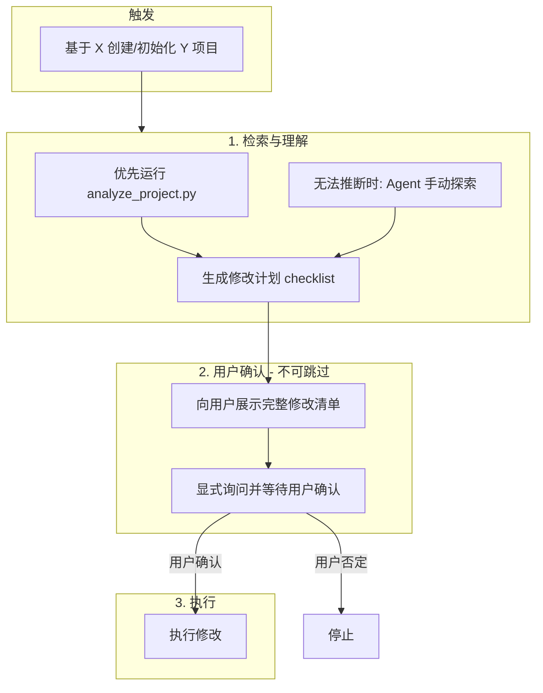

# Project Start Skill

## 前置规则（不可违反）

1. **适用场景**：当用户请求「基于 X 项目/模板 创建/初始化 Y 项目」时，无论 X、Y 的技术栈（Java、Python、Node 等），均需遵循本技能流程。
2. **禁止直接执行**：在未向用户展示修改计划并得到用户明确确认（如「确认」「可以执行」「按计划执行」）之前，**禁止**进行任何文件创建、修改、删除或目录复制。
3. **确认方式**：必须向用户展示具体修改清单（文件路径、替换内容、重命名项等），并**显式询问**是否确认执行；用户确认后再执行。

## 通用流程

收到「基于 X 创建 Y」请求：
1. 检索/理解 X（有脚本则运行，无脚本则手动探索）
2. 生成修改计划（输出 checklist）
3. 向用户展示计划，显式询问是否确认
4. 仅当用户确认后执行



## 确认步骤规范

1. **展示内容**：修改清单须包含
   - 将修改的文件路径及变更类型（替换/重命名/删除）
   - 关键替换内容（from → to）
   - 目录/文件重命名列表

2. **展示方式**：必须引用或嵌入生成的文件（如 `@xxx-checklist.md`），不得仅用文字概括。

3. **确认话术**：在展示后必须包含类似询问：
   > 以上为计划的修改内容，请确认是否按此执行？确认后我将开始执行。

4. **执行门槛**：仅在用户明确表示「确认」「可以执行」「按计划执行」等肯定答复后执行；若用户要求修改计划，则更新计划后再次展示并重新确认。

---

## 优先使用 analyze_project.py（Java/Python/Node）

`analyze_project.py` 支持 Java（pom.xml）、Python（pyproject.toml）、Node（package.json）项目的自动发现。**无论技术栈，均应优先尝试运行该脚本**；仅当推断失败（如 `brand.old`、`package.old` 为空）时，再采用手动探索。

### 调用方式

```bash
python scripts/analyze_project.py --path /path/to/project --brand-new X --package-new Y --output report-prefix
```

- **必须**传 `--brand-new`、`--package-new` 才会生成 config 文件
- **建议**始终传 `--output`，使用工作区可见路径（如 `{workspace}/xxx-report`）；未传时输出至 `{project_root}/analyze-output`，会污染模板项目
- `--cap-new`：若品牌含首字母缩写（如 SuperRAG），请指定 PascalCase 形式
- `--no-deep-scan`：大项目可加速

### 生成文件

- `{output}-config.yaml`：可执行配置草稿
- `{output}-report.yaml`：分析报告
- `{output}-checklist.md`：修改清单（**必须**向用户展示）

### 展示要求

**必须**在回复中：
1. 明确列出生成文件路径（config、report、checklist）
2. 读取或嵌入 `*_checklist.md` 内容，或用 `@文件路径` 引用
3. **提示用户完成「确认前自检」**（checklist 中的自检清单）
4. 展示内容包括：`brand.old/new`、`package.old/new`、`replacements`、`file_renames`、`directories.rename`、`cap_old/cap_new`、`preserve`、`build.verify_command`（如有）

**禁止**：仅用文字概括而不引用任何生成文件。

### 执行（用户确认后）

**推荐流程**：`analyze` → 查看 checklist 并完成确认前自检 → （可选）`create_project --dry-run` 预览 → 用户确认 → `create_project` → （可选）`--verify` 或手动验证

```bash
# 方式一：create_project（推荐，自动复制 + 初始化）
python create_project.py --template SOURCE --config report-config.yaml --output DEST --dry-run  # 建议先预览
python create_project.py --template SOURCE --config report-config.yaml --output DEST
python create_project.py --template SOURCE --config report-config.yaml --output DEST --verify  # 执行后自动验证构建

# 方式二：init_project（在已有副本上初始化）
python init_project.py --config report-config.yaml --project-root /path/to/project --dry-run
python init_project.py --config report-config.yaml --project-root /path/to/project
```

---

## 无法推断时的用法（手动探索）

当 `analyze_project.py` 推断失败（report 中 `brand.old`、`package.old` 为空或 needs_review 需人工指定）时，Agent 手动探索并生成 checklist。

### 发现与输出

扫描目录结构、`pyproject.toml`/`package.json`/`pom.xml`、入口文件；推断包名、品牌、需替换字符串、需重命名文件/目录；输出 `{新项目名}-checklist.md`，含 old/new 映射、文件清单、目录重命名表。

---

## 命名四层与分析结果（泛化用法）

为提高对任意项目的泛化能力，`analyze_project.py` 的输出中引入了统一的抽象层：

- **identity.brand**：品牌/产品名
  - `identity.brand.selected`：当前推断出的品牌（等价于顶层 `brand.old/new`）
  - `identity.brand.candidates[]`：候选列表，包含 `value`、`source`（来源，如 `pyproject.project.name`、`package.json.name`、`maven.artifactId`）、`confidence`、`why`
- **identity.package**：包名/模块名（import/require 使用）
  - `identity.package.selected`：当前推断的包（等价于顶层 `package.old/new`）
  - `identity.package.candidates[]`：候选列表，包含 `value`、`source`、`count`、`confidence`
- **identity.module_dirs / structure.module_dirs**：源码根目录
  - 顶层源码目录（如 `src`、有 `__init__.py` 的 Python 包根目录等），带 `kind`（`python_package` / `source_root` / `generic`）
- **identity.binaries**：CLI / 服务名
  - 例如从 `pyproject.toml [project.scripts]` 中解析出的 `xxx-server` 等入口

在人工确认阶段，建议显式对照这四层概念：

- **brand**：对外展示名称（UI、README、域名、服务名）。
- **package**：代码 import/require 的包/模块名（Python 包名、Java 包前缀、Node 包等）。
- **module_dirs**：源码实际所在目录（可能与包名不同，例如目录叫 `UltraRAG` 但包名仍为 `ultrarag`）。
- **binaries**：命令行/服务入口名（如 `ultrarag-server`）。

推荐增加的通用自检（适用于任意语言生态）：

- [ ] `identity.brand.selected` 是否仅用于展示层，而不会错误用作 import 名称？
- [ ] `identity.package.selected` 是否是目标语言中**合法且推荐**的包/模块名（Python 小写、Node 推荐 kebab-case/小写等）？
- [ ] 目录结构（`identity.module_dirs`）与包名/命名空间是否匹配，是否需要保持目录名不变、只改品牌？
- [ ] `identity.binaries` 中的 CLI 名是否需要同步更名？更名后是否会影响用户脚本/文档？

---

## dynamic_links 与 preserve.candidates（避免隐性坑）

`analyze_project.py` 会尝试自动发现「配置文件字段 ↔ 源码属性」之间的动态绑定关系，以及可能需要保留（不替换）的第三方前缀：

- **dynamic_links**（当前主要覆盖 Python/`pyproject.toml`，可扩展到其他语言）：
  - 典型场景：`project.version = { attr = "pkg.__version__" }`
  - 输出结构示例：
    - `from`: `{\"file\": \"pyproject.toml\", \"field\": \"project.version\"}`
    - `to`: `{\"module_attr\": \"ultrarag.__version__\"}`
    - `confidence`: `high|medium|low`
    - `why`: 推断原因说明
  - 后续初始化时，若包名/模块名需要调整，**必须同步更新这些 dynamic links**，否则会出现类似 `ModuleNotFoundError` 的问题。

- **preserve.candidates**：
  - 从 pom.xml 等配置中自动挖掘**第三方 groupId/域名**等前缀，例如：
    - `org.springframework`
    - `com.fasterxml`
    - 第三方域名、上游项目包前缀等
  - `preserve.patterns` 仍然作为真正生效的保护规则；`preserve.candidates` 仅是「建议列表」，便于 AI 和用户一起审查、挑选。

在确认前自检中，建议额外核对：

- [ ] dynamic_links 中所有 `from`/`to` 是否与新的包名/模块名对应？
- [ ] 是否有需要保留的第三方前缀尚未加入 `preserve.patterns`（可以参考 `preserve.candidates`）？

### 执行（用户确认后）

按 checklist 逐项执行：复制目录、重命名、内容替换。建议先备份源项目。有 config 时用 `init_project.py`，否则按 checklist 手动操作。

---

## 预设框架（可选快捷方式）

当用户明确指定 ContiNew、RuoYi 等且有预设时，可跳过部分推断，但**仍需展示将修改的内容并等待用户确认**。

| 框架 | 品牌 | 包路径 |
|------|------|--------|
| ContiNew Admin | continew | top.continew.admin |
| RuoYi | ruoyi | com.ruoyi |

详见 `assets/framework-presets.yaml`。预设不改变主流程：检索 → 理解 → 确认 → 执行。

---

## 资源

### scripts/analyze_project.py

扫描 Java（pom.xml）、Python（pyproject.toml）、Node（package.json）项目，推断 package、brand、cap_old、directories、命名变体、文件重命名及引用；输出 config、report、checklist。

### scripts/init_project.py

执行初始化。支持 `--framework continew|ruoyi`、`--interactive`、`--config`、`--dry-run`。

### scripts/create_project.py

从模板文件夹复制并初始化新项目。接口：`--template`、`--config`、`--output`、`--dry-run`（预览）、`--verify`（执行后自动跑 verify_command）。

### assets/framework-presets.yaml

框架预设（brand/package/directories 默认值），仅作可选加速。

### assets/config-template.yaml

批量操作配置文件模板。

---

## 核心操作（Java 项目）

### 1. 目录重命名

将含品牌前缀的目录重命名。`directories.rename` 按深度排序。

### 2. 包路径替换

更新 Java 包路径。范围：`.java`、`.xml`、`.yml`、`.yaml`、`.properties`、`.json` 等。

### 3. 内容替换（命名风格三维映射）

- **brand**（lowercase、snake_case、kebab-case）：模块名、文件名、CLI、包名 → `brand_new`
- **cap**（PascalCase/CamelCase）：类名、类型名 → `cap_new`（可经 `--cap-new` 或 config 指定）
- **upper**（ALL_CAPS、UPPER_SNAKE、UPPER_KEBAB）：常量、环境变量、Storage Key → `brand_new.upper()`
- `preserve.patterns`：**整行级**，命中 pattern 的行不参与替换；第三方 groupId、域名等需加入，避免误替换（如 `org.springframework`）

### 4. 模块移除

移除可选模块目录。

---

## 重要提示

- **先备份**：运行初始化前始终备份原始项目
- **确认不可跳过**：无论有无预设、有无脚本，均须展示计划并等待用户确认后再执行
- **执行后验证**：Java 多模块用 `mvn clean install`，单模块用 `mvn clean compile`；其他项目按 checklist 中的 `verify_command` 或项目惯例；或使用 `create_project --verify`
- **dry-run 预审**：有脚本时建议先 `create_project ... --dry-run` 预览，确认无误后再正式执行
- **preserve**：为**整行级**，命中 pattern 的整行不替换；第三方 groupId、域名、Storage Key 前缀等需加入 `preserve.patterns`，避免误替换（如 `org.springframework`）

---

## AI 使用 analyze 结果的通用策略（推荐）

当 Agent 拿到 `analyze_project.py` 的输出（`*-report.yaml`）后，建议按以下通用流程决策，而不是写死针对某个项目的逻辑：

1. **读取核心画像**
   - 使用 `identity.brand.selected` / `identity.package.selected` 作为初始候选；若 `candidates` 中存在更高置信度或更符合命名规范的值，可在确认前向用户提出。
   - 结合 `identity.module_dirs` 判断是否需要同时改目录名，还是只改品牌/包名。
   - 根据 `identity.binaries` 决定是否同步更新 CLI/服务名及相关文档。

2. **基于 actions 分层决策**
   - `actions.rename_directories` / `actions.rename_files`：
     - 一般为 **medium impact** 操作，影响代码与配置路径；建议始终在 checklist 中展示，并等待用户确认。
   - `actions.replace_content`：
     - 按 `type`（brand/package/upper/...）与 `count` 判断风险：
       - `brand` / `package` 且 `count` 较小：可结合 `preserve.patterns` 自动替换。
       - `upper` 类型（常量、环境变量名等）：通常为 **high impact**，建议显式列出，必要时只在配置/文档中替换，代码中保守处理。
   - `actions.update_config`：
     - 尤其是由 `dynamic_links` 生成的更新，影响构建系统和版本读取逻辑，统一视为 **high impact**，必须在 checklist 中突出展示，并在用户确认后执行。

3. **利用 dynamic_links 避免隐性错误**
   - 若用户要求修改包名/模块名，Agent 应主动检查 `dynamic_links`，在修改 import/包目录的同时同步更新配置字段：
     - 例如：`ultrarag.__version__` → `newpkg.__version__`。
   - 当 `dynamic_links` 置信度较低时（`confidence: low`），优先在 checklist 中给出原始字段/属性，并向用户说明风险。

4. **结合 verify_command 做验证闭环**
   - 优先使用 `build.verify_command` 作为初始化后的首选验证命令：
     - 库型项目：`pip install -e . && pytest`、`npm test` 等。
     - 应用型项目：构建/打包命令（`mvn clean install`、`npm run build`、`docker build` 等）。
   - 若用户未提供更精细的验证方案，Agent 可以直接建议用户在新项目中执行 `verify_command`，并根据结果进行后续调整。

> 上述策略仅依赖 `analyze` 输出的通用结构（identity/config_files/dynamic_links/actions/...），不绑定任何特定项目，可在未来扩展到更多语言与框架。

## 语言

本技能使用中文编写。
